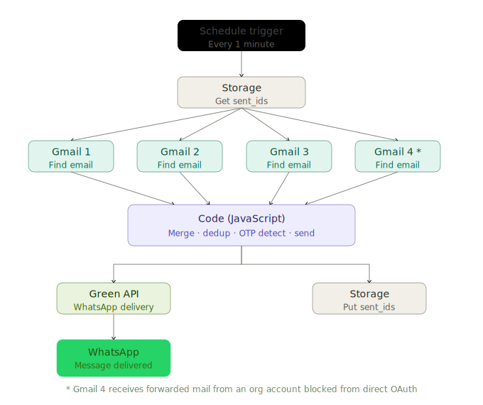

# 📬 Doot — Gmail to WhatsApp Messenger
<div align="center">
<p align="center">
  
</p>

> *"Doot" — a messenger that takes messages from one place and delivers them to another.*


---
</div>

## 🧠 What is Doot?

**Doot** is a personal automation that silently watches multiple Gmail inboxes and instantly forwards every new unread email as a WhatsApp message — so you never miss an important notification, OTP, or alert regardless of which inbox it lands in.

It runs entirely on [Activepieces](https://activepieces.com) (open-source automation platform) and delivers messages via [Green API](https://green-api.com) — no paid SMS gateway, no third-party email-to-SMS service, just your own WhatsApp number receiving clean, formatted notifications.

---

## ✨ Features

- 📥 **Multi-inbox monitoring** — polls up to 4 Gmail accounts simultaneously every minute
- 🏷️ **Inbox labeling** — every WhatsApp message tells you exactly which inbox the email came from
- 🔐 **Smart OTP detection** — automatically spots OTP/verification emails and highlights the code
- 🔄 **No duplicate notifications** — uses persistent storage to track sent email IDs, so each email is delivered exactly once even across restarts
- 📧 **Forwarding support** — org/institutional email accounts that block third-party OAuth can be forwarded to a personal Gmail and still show with the correct inbox label
- ✂️ **Email preview** — first 200 characters of body included for quick context without opening Gmail
- ⚡ **Lightweight** — no server, no database, no cost — runs on Activepieces free tier

---

## 🏗️ Architecture



### Flow explained

The flow runs on a 1-minute schedule. It starts by fetching the list of already-delivered email IDs from Activepieces Storage so it can skip emails it has already forwarded. It then polls all 4 Gmail accounts simultaneously for unread messages. All results are passed into a single JavaScript Code step that merges them, tags each email with its inbox label, skips duplicates, detects OTP patterns, formats a WhatsApp message, and sends it via Green API. Finally the updated ID list is written back to Storage so the next run knows what has already been sent.

### Why email forwarding for one account?

One of the monitored inboxes is a Google Workspace (organizational/institutional) account. Workspace admins can restrict third-party apps from accessing Gmail via OAuth — meaning Activepieces cannot directly connect to it.

The workaround: **Gmail's built-in forwarding** is an internal Google feature that doesn't require third-party app permissions. By enabling forwarding from the org account to a personal Gmail, all emails arrive in a monitored inbox automatically. The code then inspects the `To:` header of each email — forwarded emails retain the original recipient address — and correctly labels the WhatsApp message with the org inbox name rather than the receiving personal inbox.

No data ever leaves Google's own infrastructure during the forwarding step.

---

## 📨 WhatsApp Message Format

**Regular email:**
```
📧 *New Email*

*Inbox:* yourname@gmail.com
*From:* LinkedIn Job Alerts <jobalerts@linkedin.com>
*Subject:* Full Stack Engineer at Accenture and 5 more
*Time:* 22 Mar, 03:00 PM

_New jobs in your area match your preferences..._
```

**OTP / Verification email:**
```
🔐 *New Email*

*Inbox:* yourname@gmail.com
*From:* no-reply@service.com
*Subject:* Your verification code
*Time:* 22 Mar, 03:01 PM
🔑 *OTP: 847291*

_Your one-time password is 847291. Valid for 10 minutes..._
```

---

## 🛠️ Setup Guide

### Prerequisites

- [Activepieces](https://activepieces.com) account (free tier works)
- [Green API](https://green-api.com) account (free tier: scan QR with your WhatsApp)
- Gmail accounts connected to Activepieces via OAuth

### Step 1 — Import the flow

Import `Doot-GmailToWhatsApp.json` into your Activepieces instance via **Flows → Import**.

### Step 2 — Connect Gmail accounts

Connect each **Find Email** step to your Gmail account via OAuth. For any organizational Gmail account that blocks OAuth, enable forwarding: go to that account's Settings → Forwarding and POP/IMAP → Add a forwarding address pointing to a personal Gmail already connected to Activepieces.

### Step 3 — Configure Green API

1. Sign up at [green-api.com](https://green-api.com)
2. Create a free instance and scan the QR code with WhatsApp
3. Copy your `idInstance` and `apiTokenInstance` from the dashboard

### Step 4 — Fill in Code step inputs

In the **Code** step inputs, update:

| Input Key | Value |
|-----------|-------|
| `greenApiInstance` | Your Green API instance ID |
| `greenApiToken` | Your Green API token |
| `whatsappChatId` | Your number: `91XXXXXXXXXX@c.us` |

### Step 5 — Update inbox labels

In the source code inside the Code step, replace the placeholder strings with your actual email addresses so each inbox shows the correct label in WhatsApp messages. For the forwarded account, set the detection string to a unique part of that org email address to match it via the `To:` header.

### Step 6 — Publish

Hit **Publish** — Doot will start polling every minute automatically.

---

## 🧩 Tech Stack

| Layer | Technology |
|-------|------------|
| Automation platform | [Activepieces](https://activepieces.com) |
| Email source | Gmail (Google OAuth) |
| WhatsApp delivery | [Green API](https://green-api.com) |
| Deduplication storage | Activepieces built-in Store |
| Custom logic | JavaScript (Activepieces Code step) |
| Trigger | Schedule — every 1 minute |

---

## 🤝 Acknowledgements

### 💜 Activepieces

A huge thank you to the [Activepieces](https://activepieces.com) team for building such an open, developer-friendly automation platform. The ability to drop in custom JavaScript directly in the flow is what made multi-inbox merging, OTP detection, and deduplication logic possible — things no standard drag-and-drop block could do alone. The platform is genuinely a joy to build on.

This project earned two Activepieces badges along the way:

| Badge | Description |
|-------|-------------|
| 🏗️ **First Build** | *"I published my first flow and automation is officially real."* |
| 💻 **Coding Chad** | *"I used custom code and made my flow do tricks no one else can."* |

### 📱 Green API

Thank you to [Green API](https://green-api.com) for providing a reliable, free-tier WhatsApp messaging API that works with a personal WhatsApp number via simple QR scan — no business account, no Meta approval process, just a clean REST call and your message is delivered.

---

## 📄 License

MIT — use it, fork it, build on it.

---

*Built with ❤️ by Anubhav Kumar Srivastava*

<p align="center">
  
</p>
